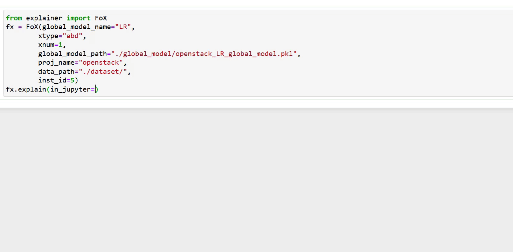

[](https://lgtm.com/projects/g/trustablefox/foxplainer/alerts/)
[](https://lgtm.com/projects/g/trustablefox/foxplainer/context:python)
[](https://codecov.io/gh/trustablefox/foxplainer)[](https://foxplainer.readthedocs.io/en/latest/?badge=latest)

<p align="center">

 
<div align="center">
<h1>
    <b>
     FoX: a Fo rmal eX plainer for JIT Defect Prediction
    </b>
</h1>
</div>

</p>



## Experiment Replication
**To replicate our experiment in the paper, please go to [this repository](https://github.com/trustablefox/exp_replication).**

## FoX 

```bibtex
@underreview{
}
```

## Quick Start FoX Tool

```bash
cd fox
```

```python
from explainer import FoX
fx = FoX(global_model_name="LR", 
           xnum='all', 
           global_model_path="./global_model/openstack_LR_global_model.pkl", 
           proj_name="openstack", 
           data_path="./dataset/",
           inst_id=5)
fx.explain(in_jupyter=False)
```

A user needs to provide the following parameters:
1. **global_model_name**: should be either ***"RF"*** (Random Forest) or ***"LR"*** (Logistic Regression)
2. **xtype (optional)**: Only needed when **xnum=1**. Support two types of explanations, specify ***"abd"*** for Abductive Explanation or ***"con"*** for Contrastive Explanation
3. **xnum**: should be either 1 or "all" (return all explanations)
4. **global_model_path**: the path to your trained global model (model should be trained using sci-kit learn library)
5. **proj_name**: the project name of your dataset
6. **data_path**: the path to the required data, **this path should contain the following 2 files**:
   
   6.a ***{proj_name}.csv*** - the complete file consisting of all training + testing data with features and label
   
   6.b ***{proj_name}_X_test.csv*** - the testing data that only contains feature columns without label  

7. **inst_id**: the row number of the instance to be explained in your testing data

Please check out [this demo notebook](https://github.com/trustablefox/foxplainer/blob/main/fox/DEMO.ipynb) as a concrete example.

## Table of Contents

* **[Installation](#installation-fox-tool)**
  * [Install via pip](#install-via-pip)
  * [Install via conda](#install-via-conda)
  * [Local install via poetry](#local-install-via-poetry)

* **[Contributions](#contributions)**

* **[Documentation](#documentation)**

* **[License](#license)**

## Install FoX Tool
```bash
pip3 install -r requirements.txt
```

### Install via pip
```bash
Will publish to PyPI and update after double-blind review
```

### Install via conda
```bash
Will publish to Anaconda and update after double-blind review
```

### Local install via poetry
Will update after double-blind review

## Contributions

We welcome and recognize all contributions. You can see a list of current contributors in the [contributors tab](https://github.com/trustablefox/foxplainer/graphs/contributors).

## Documentation  
Documentation page is ready, we will update and publish after double-blind review.

## License
[MIT License](https://github.com/trustablefox/foxplainer/blob/main/LICENSE)

